> 안녕하세요, 저는 유디에스 데이터플랫폼 그룹의 데이터 분석 및 API 개발을 담당하고 있는 허훈석 연구원입니다. 이 글에서 University of Cincinnati, Chao Jin의 박사 학위논문인 Methodology on Exact Extraction of Time Series Features for Robust Prognostics and Health Monitoring에 대한 논문 세미나 내용을 공유드리고자 합니다.

## 고장 예지 및 건전성 관리란?

고장 예지 및 건전성 관리(Prognostics and Health Management, PHM)는 설비의 데이터를 수집하여 **시스템 이상상황을 감지**하고 **분석 및 예지진단**을 통해 **고장시점을 사전에 예측**함으로써 **설비관리를 최적화하는 기술**입니다.

## Related Work
>1. Threshold tuning 
>Threshold를 조정하는 것은 시간이 많이 걸리고 경험에 의존하기에 일시적인 해결책에 불과합니다.
>
>2. Back-end model improvement 
>백엔드 알고리즘을 강화하는 연구는 특정 문제나 데이터마다 다르게 적용되며 많은 데이터가 필요합니다.
>
>3. Front-end preprocessing and feature engineering 
>연구가 활발하지 않아 효과적이고 체계적인 전처리 방법이 부족합니다.

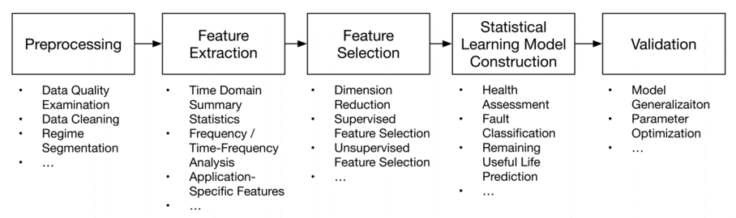

여기서 **Front-end**는 수집된 데이터가 통계 또는 머신러닝 모델링을 위해 적절한 형식으로 전처리되는 것으로 위 그림에서 1-3단계에 해당합니다.  **Back-end**는 예측 기능을 제공하기 위해 통계 또는 머신러닝 학습 모델링을 수행하는 것으로 위 그림에서 4,5단계에 해당합니다.

## Proposed Method

- ### Approach Overview

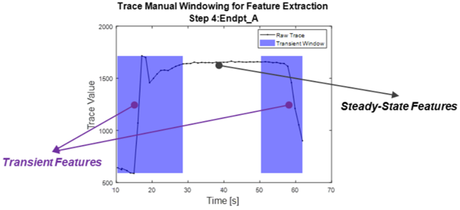

시계열 패턴인식은 관심있는 패턴을 식별하고 분류하는 것으로 생물정보학, 이미지 처리, 음성 인식 등 많은 분야에서 활용되고 있습니다. 저자가 제안한 Exact Feature Extraction(EFE)는 패턴별로 feature를 추출할 수 있는 체계적인 전처리 방법으로, 이러한 feature는 시계열 신호의 중요한 속성을 나타냅니다.

- ### Hierarchical Multi-Label Time Series Classification (HMC)

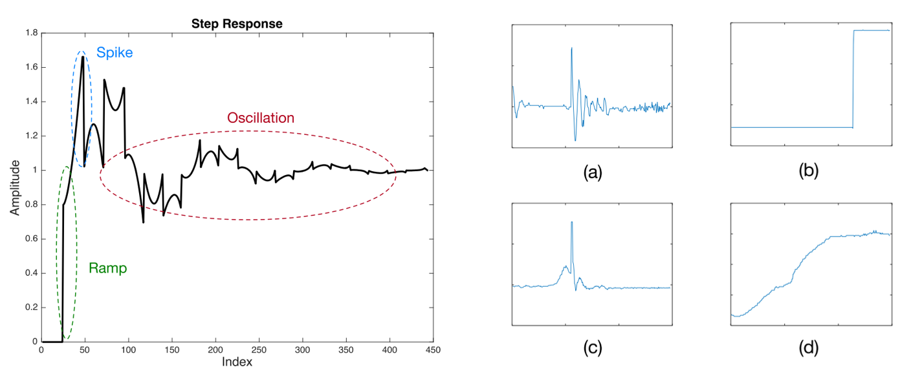   시계열 신호에는 Oscillation, Piecewise constant, Spike, Ramp로 4가지  기본 패턴이 존재합니다. 이 4가지 패턴은 서로 독립적이기 때문에 패턴을 하나씩 분류하여 한 패턴에서 다른 패턴으로의 영향을 최소화할 수 있도록 계층적 분류 접근 방식이 필요합니다. 예를 들어, Spike와 Piecewise constant는 둘 다 첨도값이 크기 때문에 첨도가 feature일 경우 동시에 분류할 수 없습니다. 따라서, 계층적으로 한 번에 하나의 패턴만을 대상으로 한다면 분류할 수 있습니다.

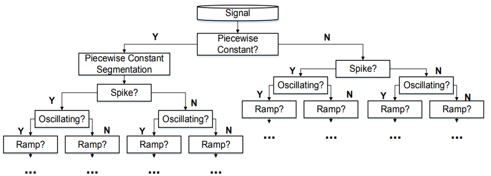

Raw signal에서 4가지 패턴을 대략적으로 Piecewise constant, Spike, Oscillating, Ramp 순서로 분류합니다.

- ### Flowchart

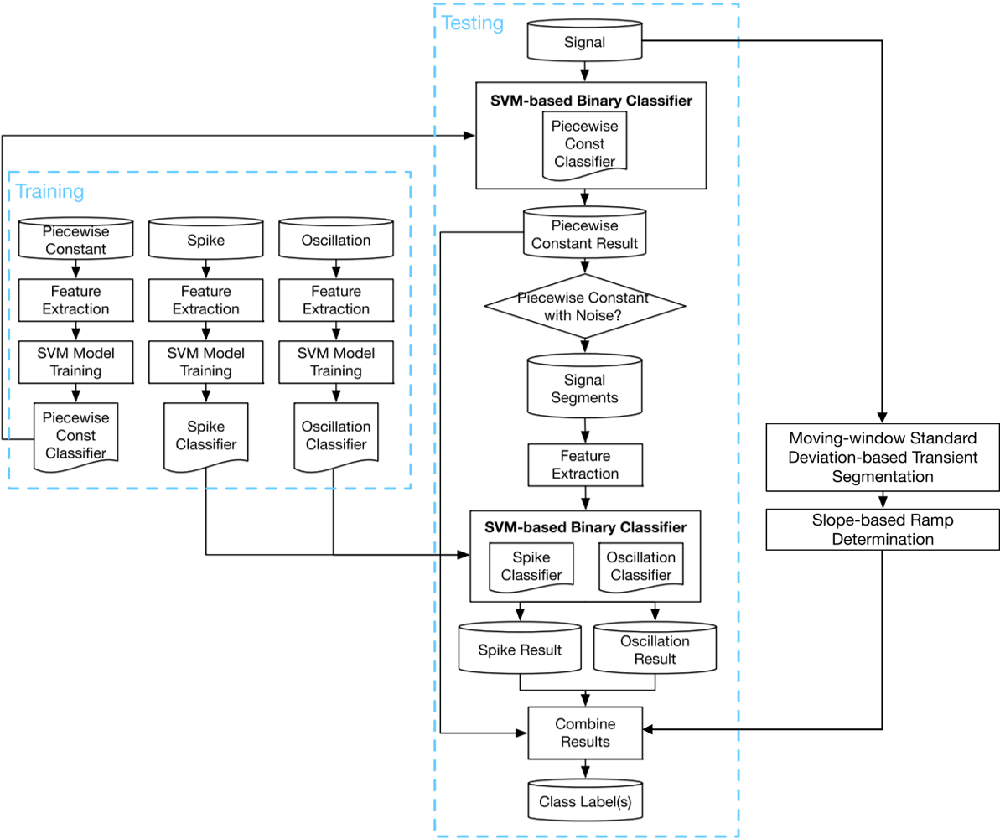

먼저 Piecewise constant Classifer로 Raw signal을 분류합니다. Pure Piecewise constant가 아닐 경우 Piecewise Constant Segmentation(PCS)을 진행합니다. 여기서 PCS의 자세한 원리는 2011년에 출간된 Geurts의 Pattern Extraction for Time Series Classification에서 확인할 수 있습니다. Controller에서 얻은 신호가 대부분 Step Responses이기 때문에 Piecewise constant는 가장 일반적인 패턴입니다.  따라서, 신호를 더 간단한 구조로 분할하기 위하여 PCS를 수행하는데, 분할 갯수를 사용자가 정의해야 하는 것이 이 방법의 단점입니다.

- ### Piecewise constant segmentation

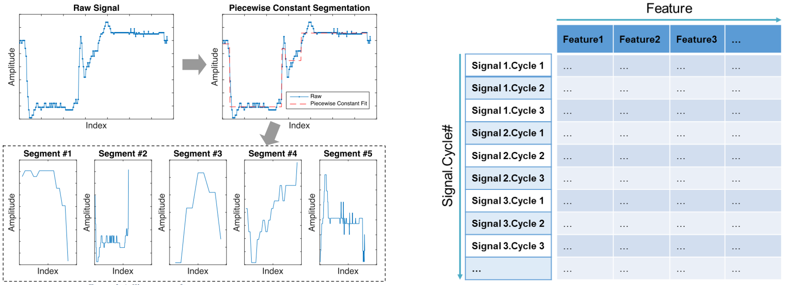

Segments의 수는 경험적으로 판단되지만 5개를 넘기지 않는 것을 권장합니다. 왼쪽 그림처럼 분할된 5개의 신호에 대해서 오른쪽 그림과 같은 Feature Matrix 생성한 후 이 값을 SVM 기반 분류기에 입력하여 Spike와 Oscillation을 분류합니다. 

- ### Moving-Window Standard Deviation-Based Transient Detection

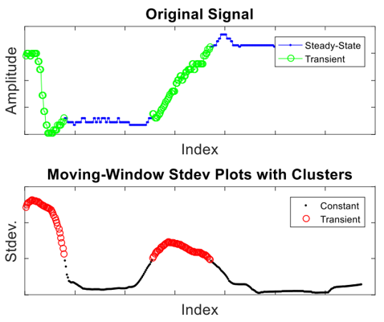

PCS는 steady-state 영역을 식별하는데 초점을 맞추고 있기 때문에 transient 영역이 손상되어 ramp를 탐지하기 어렵습니다. 따라서, Piecewise constant, Spike, Oscillation을 분류한 후 Raw signal에 Moving-Window Standard Deviation(MWSD)을 적용하여 transient 영역을 탐지합니다. MWSD란 Sliding Window 방법으로, Window를 X축을 따라 이동하면서 연속적으로 표준편차를 계산하는 것입니다. MWSD를 적용하여 표준편차가 기준값보다 큰 부분을 Transient 영역이라고 식별합니다.

- ### Result

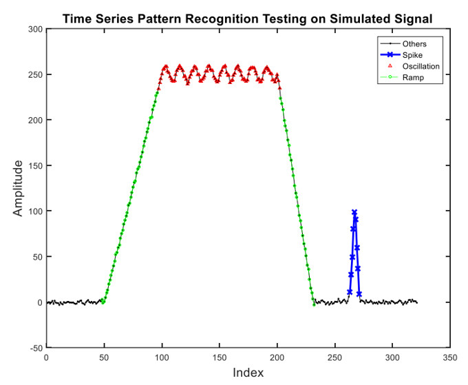

이와 같은 과정을 진행하면 위의 그림과 같은 결과를 얻을 수 있습니다.

## Case Study – Semiconductor Etching Process Fault Detection 

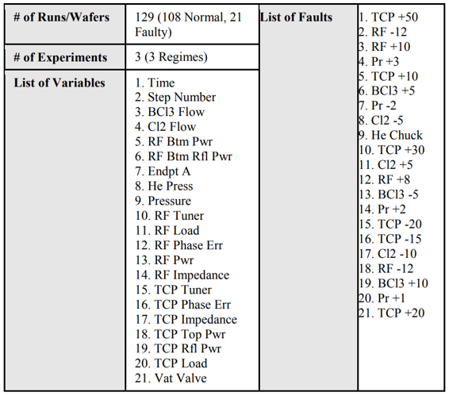

저자는 반도체 식각 공정 결함 감지를 통해 제안한 방법의 우수성을 검증했습니다. 식각 공정이란, Wafer에 그릴 회로의 패턴 중 필요한 부분만 남기고 불필요한 부분을 깎아내는 작업입니다. 즉, 반도체 회로 패턴을 만드는 공정입니다.
저자는 총 129개의 Wafer를 3번에 걸쳐 실험하였으며 19개의 장비에서 신호 데이터를 수집했습니다. 각 실험에서 서로 다른 유형의 결함이 발생하였습니다.

- ### Overall flow of the fault detection modeling

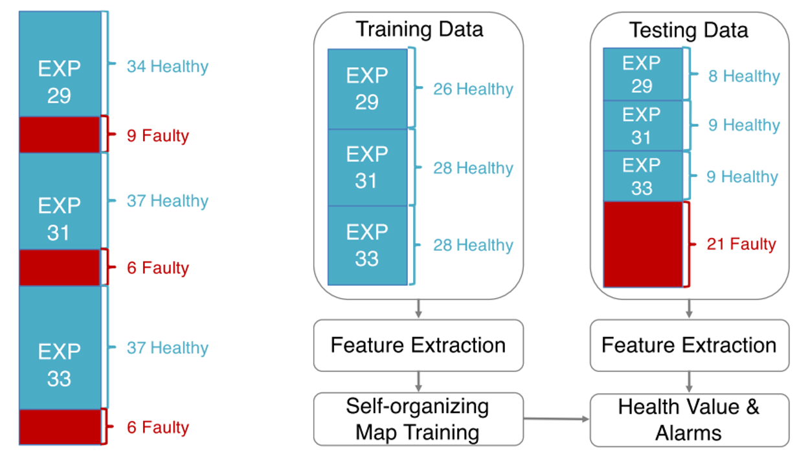

108개의 정상 데이터 중 82개를 Train Data로 사용하였으며 나머지 정상 데이터와 비정상 데이터를 Test Data로 사용하였습니다.

- ### Back-end model

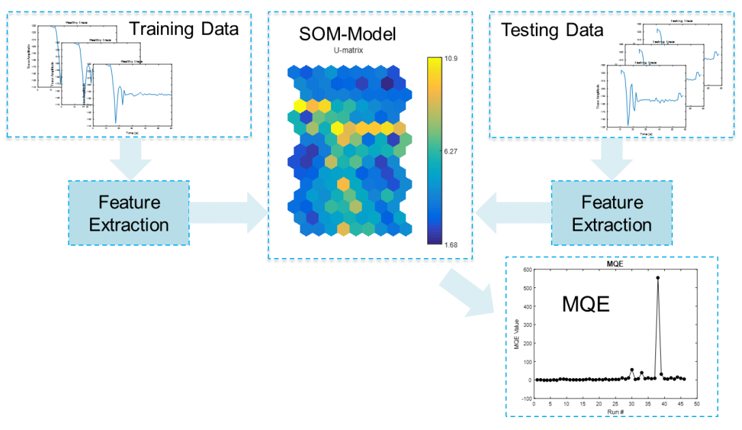

Back-end model은 Self-Organizaing Map (SOM) – Minimum Quantization Error (MQE)입니다. SOM은 고차원 공간의 데이터를 2차원 지도에 투영하는 일종의 인공신경망입니다. SOM은 다른 인공신경망과 다르게 훈련 중 오류를 최소화하기보다 경쟁 학습을 활용합니다.
MQE는 Feature vector와 Best Matching Unit (BMU) 사이의 Euclidean Distance입니다. 이 값이 높을수록 시스템이 비정상이라고 판단할 수 있습니다.

- ### Result

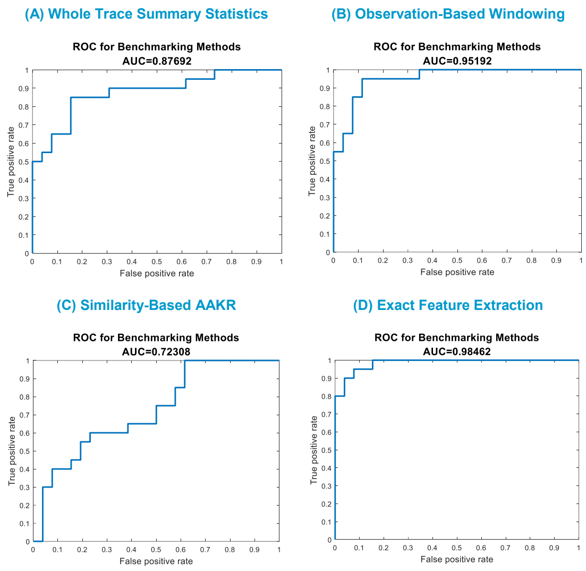

> (A) Whole Trace Summary
신호 전체에 대한 요약통계량을 계산하는 방법입니다.
>
>(B) Observation-based Windowing
사람이 직접 Transient와 Steady-state 영역을 설정하여 영역별로 요약통계량을 계산하는 방법입니다.
>
>(C) Similarity-Based Auto-Associative Kernel Regression (AKKR)
정상 상태동안 수집된 과거 데이터와 현재 수집된 데이터를 비교하여 정상 상태에서 예상되는 데이터를 추정하는 비모수 회귀모델입니다.
>
>(D) Exact Feature Extraction (EFE)
저자가 제안한 방법입니다.

위 그림은 4가지 방법에 대한 ROC Curve입니다. ROC (Receiver Operation Characteristic) Curve란 모든 임계값에서 분류 모델의 성능을 보여주는 그래프입니다. AUC (Area  Under  the  Curve)는 ROC Curve 아래 영역의 넓이이며 AUC가 1에 가까울수록 분류 모델의 성능이 훌륭하다는 뜻입니다. 따라서, 저자가 제안한 방법인 EFE의 AUC가 0.98462로 가장 크기 때문에 성능이 가장 좋습니다.

ROC Curve에 대해 조금 더 설명해보겠습니다. ROC Curve의 X축인 False positive rate (FPR)은 비정상을 정상으로 판단한 비율이고 Y축인 True positive rate (TPR)은 정상을 정상이라고 판단한 비율입니다. TPR와 FPR은 서로 비례하는 관계가 있기 때문에 좋은 성능에 대한 지표인 TPR을 높이면 나쁜 성능에 대한 지표인 FPR도 같이 커집니다. 따라서, Threshold를 연속적으로 바꾸어가면서 TPR와 FPR을 측정하여 한 눈에 볼 수 있게 시각화한 것이 ROC Curve입니다.

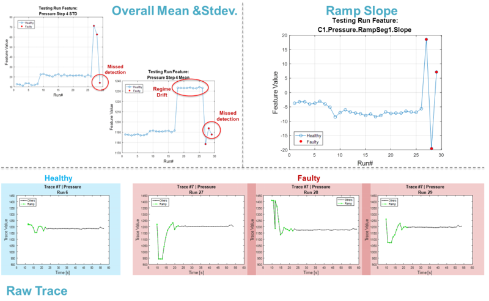

좌상단 그림처럼 Whole Trace Summary는 실험이 바뀔 때마다 요약통계량이 Drift하는, Regime Drift 현상이 발생합니다. 따라서 Multi-regime에 영향을 받지만 EFE의 Ramp Slope과 같은 Feature Value는 실험이 바뀌어도 Drift하는 현상이 없다는 것을 우상단 그림에서 확인할 수 있습니다. 따라서 EFE는 Multi-regime에 영향을 받지 않는다는 장점이 있습니다.

## Summary
지금까지 이 논문의 내용을 아래와 같이 요약할 수 있습니다.
>1. 4개의 패턴을 계층적으로 분류
>
>2. Transient와 Steady-state 영역을 분류
>
>3. Case Study를 통해 제안한 방법이 기존 방법보다 뛰어나다는 것을 검증

기존 방법들은 Transient-rich한 시계열 신호에서 성능이 떨어집니다. 따라서 계층적으로 패턴을 분류하는 EFE는 관심있는 패턴을 정확하게 식별하고 분류할 수 있습니다. 또한, Multi-regime에 영향을 받지 않기 때문에 특정 문제나 상황, 데이터에 종속되지 않기 때문에 확장 가능성이 있습니다.

감사합니다.
