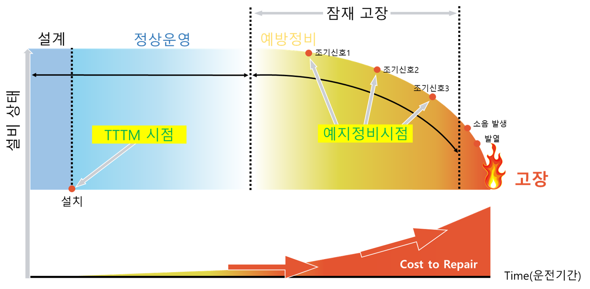
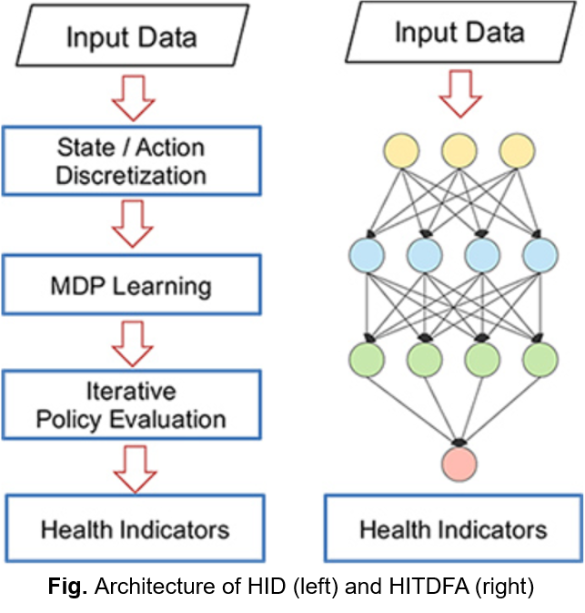
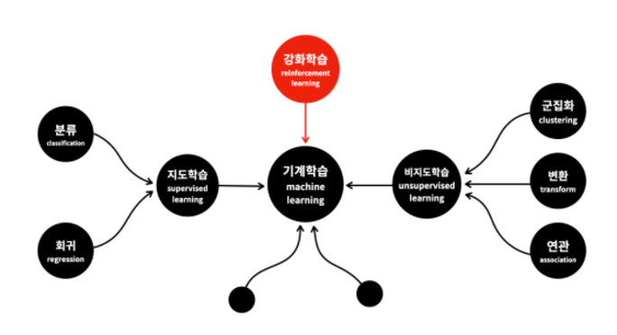
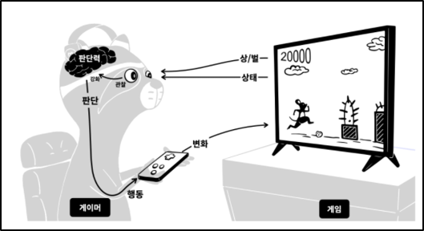
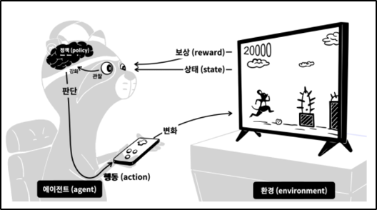
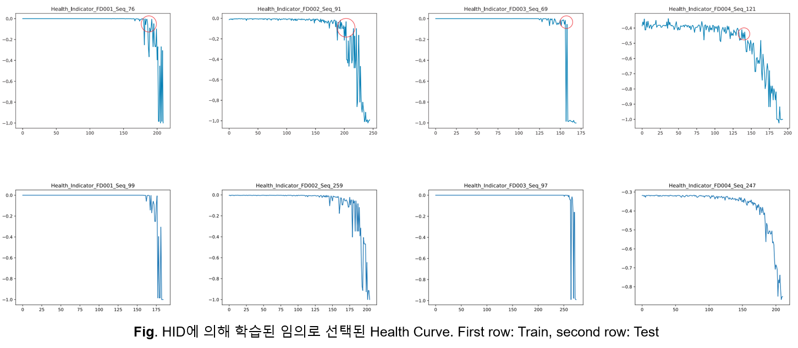
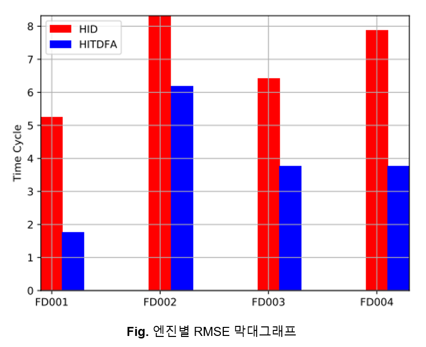
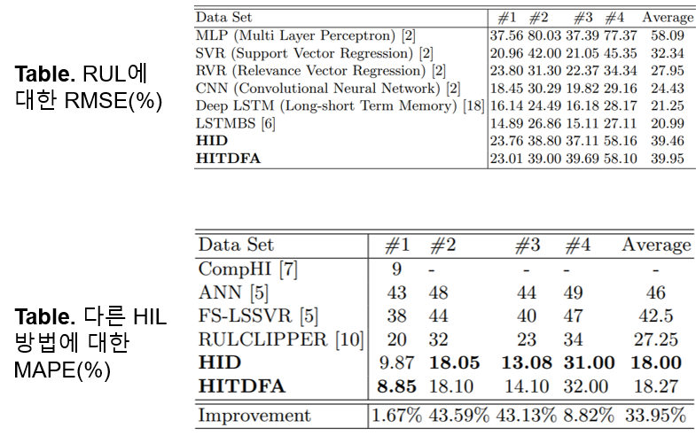

> 안녕하세요, 저는 유디에스 데이터플랫폼 그룹의 데이터 분석 및 API 개발을 담당하고 있는 허훈석 연구원입니다. 이 글에서 2018년 Ireland의 Dublin에서 진행된 ECML PKDD (European Conference on Machine Learning and Principles and Practice of Knowledge Discovery in Databases)에서 Chi Zang 등 5명이 저술하고 발표한 논문인 Equipment Health Indicator Learning Using Deep Reinforcement Learning에 대한 논문 세미나 내용을 공유드리고자 합니다.

## Predictive Maintenance (PdM)

산업 운영의 중요한 목표 중 하나는 예기치 않은 장비 고장을 최소화하는 것입니다. 이를 위해 정상 작동 중인 장비의 성능과 상태를 모니터링하여 고장 가능성을 줄이는 유지 보수인 Predictive Maintenance (PdM)이 필요합니다. 하지만 예지 정비 시점을 파악하기 어려워 주기적으로 유지 보수하는 예방 정비를 실시합니다. 이는 곧 비용 증가로 이어집니다.

현대 장비는 고장이 자주 발생하지 않을 뿐더러 작업 중에 장비의 실제 상태를 관찰할 수 없습니다. 장비가 고장난 경우에만 상태를 관찰하기 때문에 미래의 건강 상태를 예측하기 위한 데이터를 수집하는 것은 굉장히 어렵습니다.

지금까지는 도메인 지식을 기반으로 KPI (Key Performance Index)를 직접 개발하여 문제를 해결하였습니다. 하지만 장비는 일반적으로 다양한 작동 조건 속에서 건강 상태 및 실패 모드가 크게 달라지기 때문에 수동으로 개발된 단일 KPI로 상태를 진단하는 것은 매우 어렵습니다. 또한 KPI를 개발하는 것은 많은 시간과 비용이 소모되며 도메인별 KPI의 일반화가 불가능하다는 단점이 있습니다.

## Health Indicator Learning (HIL)

HIL은 시간 경과에 따른 장비의 건강 상태를 나타태는 Health Curve를 학습합니다. 즉, 건강 저하를 시각적으로 모니터링하고 장비 downtime 최소화를 위한 계획 수립이 가능합니다.

HIL로 Failure Prediction (FP)와 Remaining Useful Life (RUL) 문제를 해결하고자 합니다. 여기서 FP는 다음 k일 내에 고장이 발생할지 여부를 판단하는 분류 문제이며 RUL은 장비가 고장날 때 까지 남은 일수 l을 추정하는 회귀 문제입니다. 이 문제들은 HIL로 Health Curve를 얻으면 해결할 수 있습니다.

## Proposed Method

- ### Approach Overview

따라서 저자는 HIL을 Credit assignment problem으로 모델링 후 DRL (Deep Reinforcement Learninig) 적용한 2가지 방법을 제안하였습니다.

>1. **HDP  (Health  Indicator Directly)** 
>MDP (Markov Decision Process)  모델을 기반으로 반복적인 정책 평가를 사용하여 건강 상태를 나타내는 가치 함수를 학습
>
>2. **HITDFA (Health Indicator Temporal Difference learning with Function Approximation)** 
>MDP 모델에 의존하지 않고 심층 신경망을 활용하여 가치 함수를 학습

- ### Reinforcement Learning

지도학습이 배움을 통해 성능을 향상시키는 것이라면 강화학습은 경험을 통해 성능 향상을 이루어냅니다. 즉, 행동의 결과가 자신에게 유리한 것이라면 상을 받고 불리하면 벌을 받습니다. 이러한 과정을 정말 많이 반복하면 더 많은 보상을 받을 수 있는 더 좋은 답을 찾아낼 수 있다는 것이 강화학습의 기본 아이디어입니다.

강화학습을 게임 실력을 키워나가는 과정으로 비유해보겠습니다.

>1. 게임은 게이머에게 현재 상태를 보여줍니다. 캐릭터는 어디에 있고, 장애물은 어디에 있는지 알려줍니다.
>2. 동시에 현재 점수도 알려줍니다. 게이머는 이 값이 높아지는 것이 상이고, 장애물에 부딪히는 것이 벌입니다.
>3. 관찰의 결과에 따라서 어떤 상태에서 어떻게 행동해야 더 많은 상을 받고, 더 적은 벌을 받을 수 있는 지를 알게 됩니다.
>4. 즉, 판단력이 강화된 것입니다.
>5. 판단에 따라서 행동을 합니다.
>6. 그 행동은 게임에 변화를 주게 됩니다.

이런 과정을 반복하면 판단력이 점점 강화됩니다. 이것이 현실에서 게임의 실력자가 되는 과정입니다. 강화학습은 이러한 과정을 모방해서 기계를 학습시키는 것입니다. 이 과정을 강화학습에서 사용하는 용어로 바꾼 것이 아래 그림입니다.

- 게임 → 환경 (environment)
- 게이머 → 에이전트 (agent)
- 게임화면 → 상태 (state)
- 상과 벌 → 보상 (reward)
- 게이머의 판단력 → 정책 (policy)

강화학습에서는 더 많은 보상을 받을 수 있는 정책을 만드는 것이 핵심입니다. 이렇게 만들어진 정책은 게임의 인공지능 플레이어를 만드는데 사용될 수 있습니다. 강화학습으로 구현된 대표적인 소프트웨어가 알파고입니다.

## Experiment

- ### Turbofan Engine Degradation Simulation Data Set

NASA에서 공개한 터보엔진의 가상 시뮬레이션 성능저하 데이터셋을 기반으로 RUL 문제를 해결하고자 하는 실험을 진행하였습니다. 이 데이터셋은 다중 센서 기반 다변량 시계열 Train & Test Data로 구성되어 있습니다. 엔진 성능에 영향을 미치는 3개의 작동 설정 데이터와 21개의 센서 데이터로 구성되어 있습니다. 좌측에 21개의 센서 데이터에 대한 표이고 우측은 센서 데이터의 일부를 시각화한 것입니다.

- ### Health Curve

위 그림은 HID에 의해 학습된 Health Curve 중 일부입니다. 1행이 Train Data이고 2행이 Test Data입니다.

- ### Result

이 실험은 학습된 Health Indicator를 사용하여 RUL 문제를 해결하였습니다. 학습하기 어렵다고 알려진 FD002와 FD004에서도 우수한 성능을 달성하였습니다. 각 데이터셋을 독립적으로 간주하여 다양한 정책의 간섭을 배제했기 때문입니다.

Test Data에서 실제 고장 시간과 예측 시간에 대한 RMSE로 성능 평가를 진행하였습니다. HID의 경우, FD001과 FD003이 나머지에 비해 정책이 단순해서 더 좋은 성능을 보였습니다. Model-free인 HITDFA는 Model Quality에 영향을 받지 않으므로 더 좋은 성능을 보였습니다.

LSTM, CNN보다 성능이 떨어지지만 MLP보다 성능이 뛰어납니다. 하지만 DL 기반 RUL 추정은 시간 경과에 따른 상태 저하에 대한 통찰력 없이, 고장 발생까지 남은 일수에 대한 단일 숫자만 출력하기 때문에 최적의 운영 및 유지 보수 결정을 내리기 어렵습니다. 하단의 표는 다른 HIL 방법에 대한 MAPE(Mean Absolute Percentage Errors)입니다. HID가 다른 방법에 비해 33.95% 개선되었음을 알 수 있습니다.

빨간점은 주어진 Test Data이며 파란점은 예측한 Health Indicator입니다. 초록 수직전이 예측한 실패 지점이고 파란 수직선이 실제 실패 지점입니다. 따라서, 실제 RUL과 측정된 RUL간 차이가 거의 없음을 알 수 있습니다.

## Summary

지금까지 이 논문의 내용을 아래와 같이 요약할 수 있습니다.

>1. HIL 문제를 Credit assignment problem으로 공식화하고 Health Indicator를 가치 함수의 출력으로 모델링한 첫번째 논문입니다.
>2. 단순한 물리적 속성을 제약 조건으로 사용한 Automatic hyperparameter learning approach이기 때문에 서로 다른 도메인과 산업에 광범위하게 적용될 수 있습니다.
>3. 컨볼루션 레이어와 같은 Automatic feature learning에서 심층 네트워크의 첫번째 부분으로 사용될 수 있습니다.
>4. Health level의 정의 및 세분화와 같은 많은 도메인 지식이 필요하지 않습니다.
>5. 다양한 고장 모드의 데이터가 있더라도 다양한 조건에서 작동하는 장비의 상태 지표를 학습할 수 있습니다.
>6. LSTM이 성능이 더 좋지만 RUL을 단일 숫자로 예측하고 의사 결정자에게 설명할 수 없는 복잡한 Feature map을 제공하는 단점이 있습니다. 하지만 이 논문의 방법은 Degradation curve를 제공하여 쉽게 설명 가능합니다.

감사합니다.