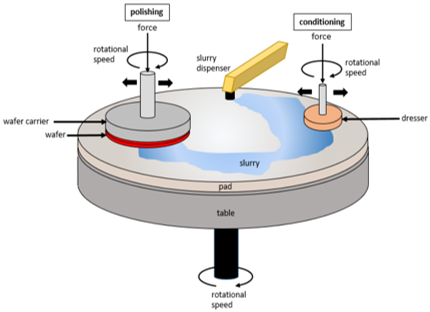
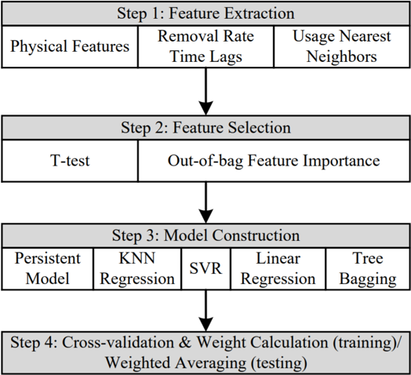
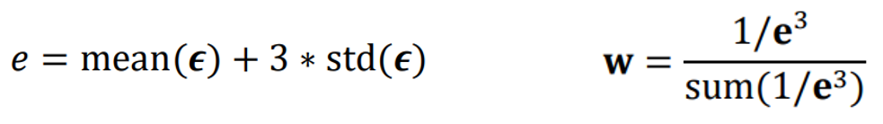
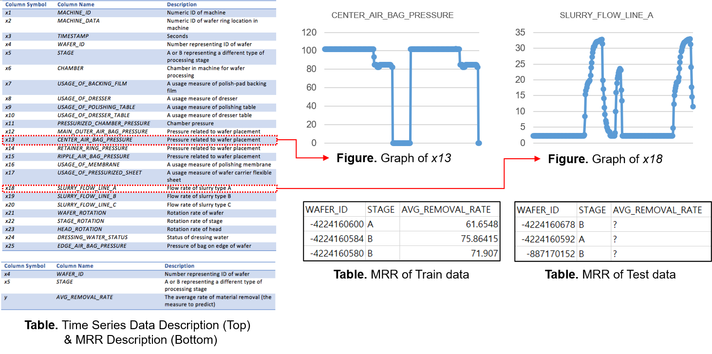
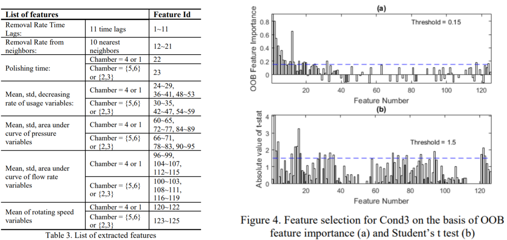
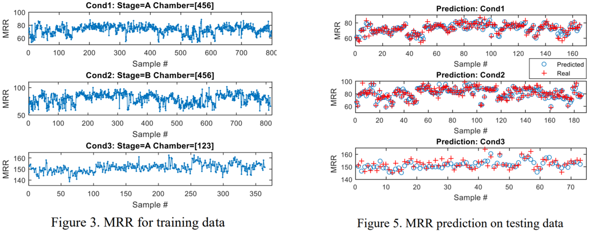
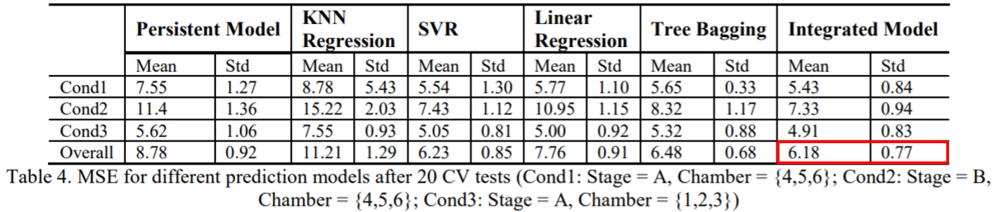
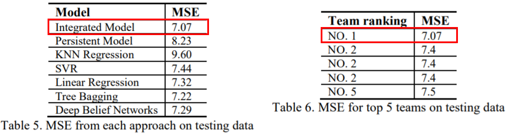

> 안녕하세요, 저는 유디에스 데이터플랫폼 그룹의 데이터 분석 및 API 개발을 담당하고 있는 허훈석 연구원입니다. 이 글에서 Yuan Di, Xiaodong Jia, Jay Lee이 저술한 논문인 Enhanced Virtual Metrology on Chemical Mechanical Planarization Process using an Integrated Model and Data-Driven Approach에 대한 세미나 내용을 공유해 드리고자 합니다. 이 논문은 2016년 PHM Society에서 주관한 PHM Data Challenge 2016에서 1위를 기록한 팀의 방법론을 소개하고 있습니다.

## Chemical Mechanical Planarization (CMP)

CMP는 화학적, 기계적 요소를 결합한 폴리싱을 통해 Wafer를 평탄화하는 공정입니다. 여기서 기계적 요소란, Wafer의 높이가 다른 영역이 패드와 접촉할 때 서로 다른 압력을 받아서 상대적으로 높은 지역이 높은 압력에 의해 먼저 폴리싱 되는 것입니다. 기계적 요소의 단점은 웨이퍼 표면에 스크래치가 발생하거나 공정 컨트롤이 불안정할 수 있다는 것입니다. 이를 보완하기 위해 Slurry를 접촉면에 분포하여 폴리싱하는 것이 CMP 공정의 화학적 요소입니다.

## Related Work
- Partial Least-square Regression (PLR) (Hirai & Kano, 2015)
- Lasso Regression (Park & Kim, 2016)
- MRR을 예측하기 위한 PLR의 변형 (Hirai, Hazama & Kano, 2014)
- Support Vector Regression (SVR) (Lenz & Bara, 2013)
- Semi-supervised SVR (Kang, Kim & Cho, 2016)
- Deep belief network based approach (Wang, Gao & Yan, 2017).

CMP 공정에서 재료 연마 제거율(Material Removal Rate, MRR)을 예측하기 위해 PLR, Lasso, SVR 등 다양한 방법론이 제시되었습니다. 하지만 공정 동안 측정된 변수가 많고 Pad와 Dresser 등 소모품의 내구도 감소로 인해 Wafer의 광택이 독립적이지 않기 때문에 MRR 예측은 여전히 어려운 문제입니다.

## Proposed Method

- ### Approach Overview

(STEP 1) 먼저, MRR과 높은 상관관계를 갖는 Feature를 추출한 후 (STEP 2) Feature space의 차원과 중복성을 줄이기 위해 Feature를 선택합니다. (STEP 3) 선택한 Features로 여러 회귀 모델을 구성한 후 (STEP 4) 회귀 모델들에 대한 교차 검증(CV)과 다중 모델 통합에 대한 가중치 계산을 수행합니다. Test Data의 경우 MRR을 예측하기 위해 가중 평균을 계산합니다.

- #### STEP 1. Feature Extraction
    - Physical Features
    - Removal Rate Time Lags
    - Usage Nearest Neighbors (kNN)

> 먼저, Preston's equation에 기반한 경험적 모델 방정식, Pad conditioning의 성능을 나타내는 Dressing Rate, 마지막으로 각 센서 데이터의 평균, 표준편차, 범위 및 곡선 아래 면적을 Physical Features로 추출합니다.
> 
> CMP 공정은 연속적이기 때문에 가장 가까운 과거의 MRR을 Removal Rate Time Lags feature로 선택합니다.
> 
> 마지막으로, 동일한 레시피 하에서 Pad와 Dresser 같은 소모품의 사용률을 제외한 모든 센서 데이터들은 서로 다른 Wafer에 대해 비슷한 경향을 보일 것입니다. 따라서, Usage Nearest Neighbors features는 kNN 알고리즘으로 결정됩니다.

- #### STEP 2. Feature Selection
    - T-test
    - Out-of-bag Feature Importance

> Student's t-test는 "두 모집단의 평균 간 차이가 없다"는 귀무가설과 "두 모집단의 평균 간 차이가 있다"는 대립가설 중에 하나를 선택할 수 있도록 하는 통계적 검정 방법입니다. T-test를 하기 위해서는 표본이 정규성, 등분산성, 독립성을 모두 만족할 때 사용할 수 있습니다.   STEP 1에서 추출한 Features와 target variables 사이의 유의한 관계를 Student's t-test로 평가할 수 있습니다.
>
> 하지만 정규성이 항상 보장되지 않기 때문에 Tree Bagging 기반인 Out-of-bag(OOB) Feature Importance를 사용합니다. STEP 3에서 모델을 학습할 때 OOB Set은 학습에 사용되지 않으므로 모델 성능을 평가하기에 적합합니다.

- #### STEP 3. Model Construction
    - KNN Regression / Support Vector Regression / Linear Regression / Tree Bagging

> 본 연구에서는 위와 같은 모델들을 채택하였습니다.

- #### STEP 4. Cross-validation & Weight Calculation
    - Monte Carlo Cross-validation (CV)
    - Weight Calculation

> 마지막 단계에서는 Train과 Test Dataset을 임의로 분리하는 Monte Carlo Cross-validation을 수행합니다.
> 
> CV에서 얻은 예측 오차를 바탕으로 위 공식을 적용하여 각 모델의 Weight를 계산합니다. 더 작은 예측 오차를 얻는 모델에 더 높은 가중치가 할당됩니다.

## Experiment

- ### PHM Data Challenge 2016

PHM Society에서 매년 Data Challenge를 개최합니다. 2016년, 물리기반의 모델링과 제공된 데이터를 사용하여 CMP 공정 후 Wafer의 MRR을 예측하는 Data Challenge가 개최되었고 24개 팀이 참가하였습니다.

좌측의 표는 주어진 데이터에 대한 설명입니다. Train Data에서 평균 MRR은 CMP 공정 전/후 두께 계측기를 이용하여 측정하였습니다. 우측의 그래프는 주어진 데이터 중 일부를 시각화한 것입니다. 주기성을 가진 시계열 데이터가 주어졌음을  확인할 수 있습니다.

Cond1, Cond2, Cond3이라는 3가지 레시피에 대한 MRR 범위가 서로 다르기 때문에 레시피별로 MRR을 예측하였습니다. 추출한 Feature List는 좌측의 표와 같으며 Feature 추출 후 우측 그래프처럼 T-test와 OOB feature importance로 지정된 임계값을 초과하는 Feature를 선택하였습니다.

CV 테스트에서 Train Data를 다르게 분할할 경우 선택된 Feature가 달라지기 때문에 무작위 분할에 의한 편향을 배제하기 위하여 모든 CV 테스트에서 Feature Selection이 반복적으로 시행됩니다. 또한, 예측 오차는 20회 테스트 후 안정적인 경향을 보였기 때문에 20회 CV 테스트 후 얻은 예측 오차를 사용하였습니다. 마지막으로, 좌측 그래프에서 Train Data의 MRR이 레시피별로 범위가 다르다는 것을 확인할 수 있습니다. 우측 그래프는 Test Data에 대한 예측 결과와 실제 데이터를 Overlap한 것으로 Cond3과 비교하여 Cond1과 Cond2는 더 높은 예측 정확도를 나타냈다는 것을 확인할 수 있습니다.

- ### Result

20회 CV 테스트에 대한 모델별 MSE의 평균 및 표준편차입니다. 통합 모델이 모든 레시피에서 개별 모델보다 우수한 성능을 보였습니다. Linear Regression은 모델이 적절하게 조정되면 괜찮은 성능을 보입니다. 하지만 Input features에 많은 영향을 받으므로 모델을 조정하는 것은 쉬운 일이 아닙니다. Tree Bagging 또한 훌륭한 성능을 보여주었지만 많은 컴퓨팅 리소스가 필요하고 훈련 속도가 느리다는 단점이 있습니다.

Data Challenge에서 제공한 평가용 Dataset에서도 통합 모델이 가장 우수한 성능을 보여주었고 참가한 24개 팀 중 1위를 기록하였습니다.

## Future Work

후속 연구 내용은 아래와 같습니다.

>1. Feature Extraction에서 센서 데이터의 요약통계량만 사용하므로 데이터에서 더욱 정확한 패턴과 각 변수에 대한 고유한 Feature를 추출하는 기술이 필요합니다.
>2. 실시간 모니터링 및 예측에서 장비 설정이 달라지거나 레시피가 변경될 수 있기 때문에 모델의 매개변수와 해당 가중치에 대한 주기적인 업데이트 필요합니다.

감사합니다.